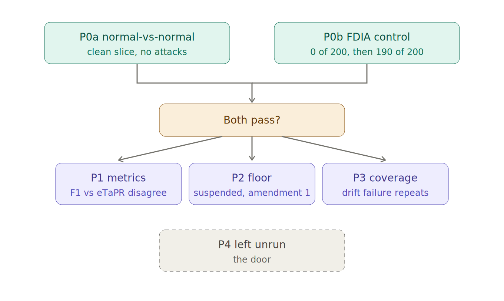
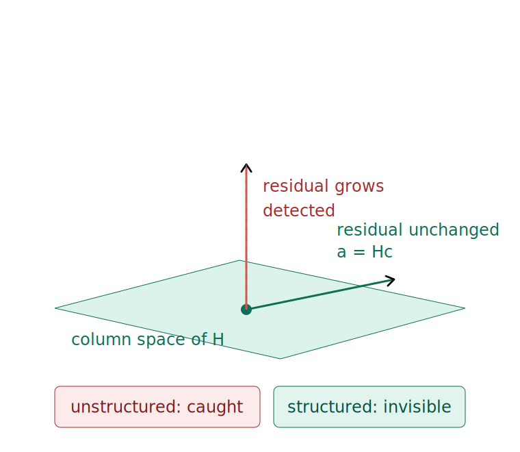

# sentinel-hai-validation

**Status: NOT RUN.** No data fetched, no detector executed, no results.

Transfer of two anomaly detectors — SENTINEL (Jensen–Shannon divergence over a
sliding window) and VERA (ridge dynamics with split conformal prediction) — from
the BATADAL water-ICS benchmark to the **HAI** power-generation ICS benchmark.

Predictions were registered before any data was fetched. See
[PREREG.md](PREREG.md), which is the first commit in this repository.

## Why HAI

HAI is collected from an ICS testbed augmented with a hardware-in-the-loop
simulator emulating steam-turbine power generation and pumped-storage
hydropower. It has the same shape as BATADAL: continuous time series, training
data containing only normal operation, test data with labelled attacks, and an
official time-aware metric (eTaPR) with published contest results.

HAI is one testbed containing a simulated grid model. It is not the power grid,
and nothing here generalises to an operating utility.

## What is in this repository

Right now: the prereg, a licence, and this file. That is deliberate. The data
fetch, the detectors, the independent eTaPR implementation and the
state-estimation control land in later commits, so that the registration is
provably earlier than the run.

## Prior work

- BATADAL transfer and the metric argument this replicates:
  [sentinel-batadal-validation](https://github.com/holland202/sentinel-batadal-validation)
- HAI dataset: https://github.com/icsdataset/hai — CC BY 4.0, the Affiliated
  Institute of ETRI. Not redistributed here; a fetch script will pull it.
- eTaPR is prior work by the HAI authors. No novelty is claimed for the
  reimplementation.

## Method

Registered predictions, numbered. An anti-vacuity control showing the
instrument can return null. Refutations kept and marked, never deleted. Numbers
in prose pasted verbatim from script output. At least one prediction left unrun.

## Figures

Both figures describe the registered method. Neither shows a result - there are none.

P0a and P0b gate everything downstream. If either anti-vacuity control fails, P1 and P3 are void rather than reported. P2 is suspended under amendment 1. P4 is registered and deliberately left unrun.

Why P0b can be stated as an exact integer. Residual-based bad-data detection measures distance to the column space of H, so an injection a = Hc moves the measurement along that space and leaves the residual identical. Structured injections are invisible by construction; unstructured ones are not. If the structured count is nonzero, the run identifies which of assumptions A1-A5 failed. See amendment 2.

SVG sources sit beside each PNG.

*Vincit Omnia Veritas.*
